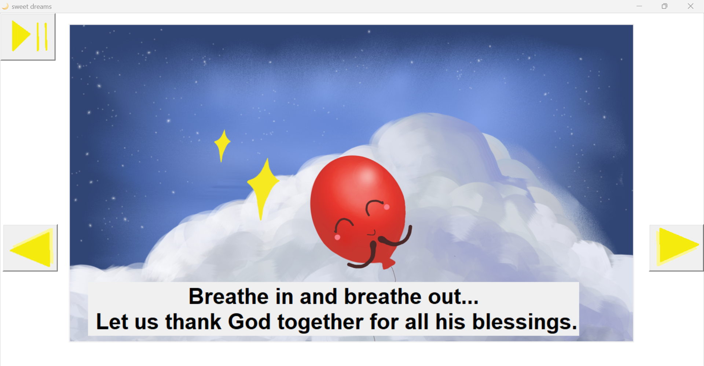
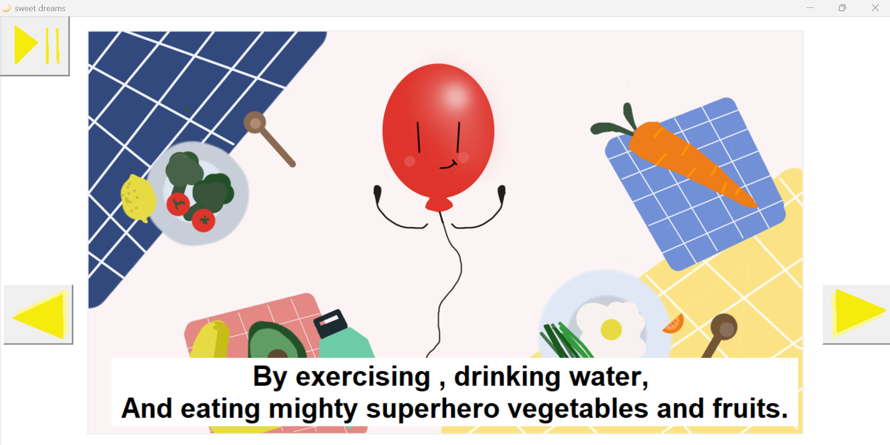

# My First Interactive Children's Book 👶🎈

Welcome to my first programming project - an interactive children's book! This project is a fun and engaging way for children to experience the joy of reading.

## Features ✨

- **Interactive Story🚀:** Children can listen to the story as it is read aloud, and interact with the book by giving feedback and listening to music.
- **Original Artwork👩‍🎨:** The story is brought to life with beautiful illustrations that I drew myself.
- **Engaging Experience🎈:** The book is designed to be engaging and interactive, making reading a fun and enjoyable experience for children.

## Sneak peek👁️

